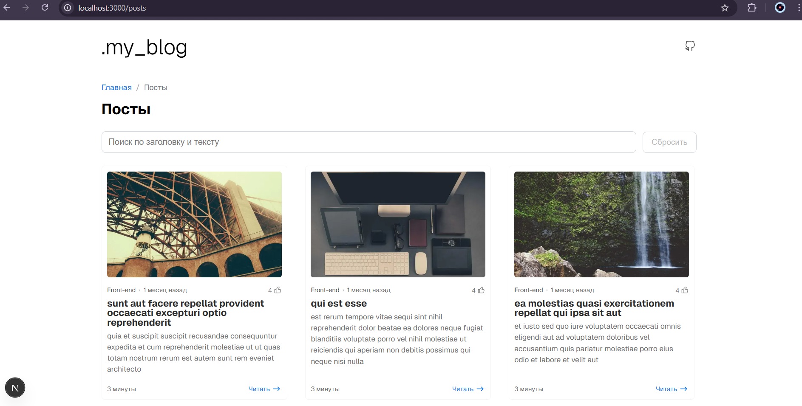

# Posts App

Frontend-проект блога на `Next.js + TypeScript` с серверным поиском, пагинацией, страницей поста, комментариями и адаптивным интерфейсом.



## Project Overview

Цель проекта — реализовать удобный и современный интерфейс для чтения постов:

- главная страница-витрина проекта;
- лента постов с серверным поиском;
- URL-driven пагинация;
- страница конкретного поста;
- комментарии и интерактив лайков;
- хлебные крошки для навигации.

## Tech Stack

- `Next.js 16` (App Router) — роутинг, server rendering и data fetching.
- `React 19` — компонентная архитектура интерфейса.
- `TypeScript` — строгая типизация доменных сущностей и сервисов.
- `CSS Modules` — локальная модульная стилизация.
- `Framer Motion` — анимации списка постов.
- `React Hook Form` — управление формой комментариев.
- `ESLint + Stylelint` — контроль качества кода и стилей.
- `Playwright` — e2e-проверка ключевого сценария поиска.

## Architecture

Проект организован по функциональным папкам:

- `app` — страницы и маршруты (`/`, `/posts`, `/posts/[id]`).
- `components` — переиспользуемые UI-компоненты (`Card`, `Pagination`, `CommentForm`, `LikeButton` и др.).
- `view` — композиционные компоненты экранов (например, `PostPageComponent`).
- `services` — работа с API (`posts`, `comments`).
- `context` — глобальный контекст приложения.
- `utils` — утилиты (например, генерация URL изображений).
- `tests/e2e` — end-to-end сценарии.

## Key Features

- Server-side поиск по постам через query-параметр `q`.
- Server-side пагинация (`_page`, `_limit`) с сохранением `q` между страницами.
- Нормализация невалидной страницы (`redirect` на последнюю доступную).
- Сценарии empty/error на странице постов.
- Хлебные крошки на списке постов и на странице поста.
- Стабильные изображения постов через `picsum.photos` (`seed` на основе `post.id`).
- E2E тест: поиск -> переход на 2 страницу -> сохранение фильтра.

## Requirements

- `Node.js 20+`
- `npm`

## Environment Variables

Создайте файл `.env.local` в корне проекта.

Минимально необходимая переменная:

```bash
NEXT_PUBLIC_DOMAIN=https://jsonplaceholder.typicode.com
```

## Local Run

```bash
npm install
npm run dev
```

Приложение будет доступно по адресу:

`http://localhost:3000`

## Production Build

```bash
npm run build
npm run start
```

## Code Quality

```bash
npm run lint
npm run stylelint
```

## E2E Tests

```bash
npm run test:e2e
```
